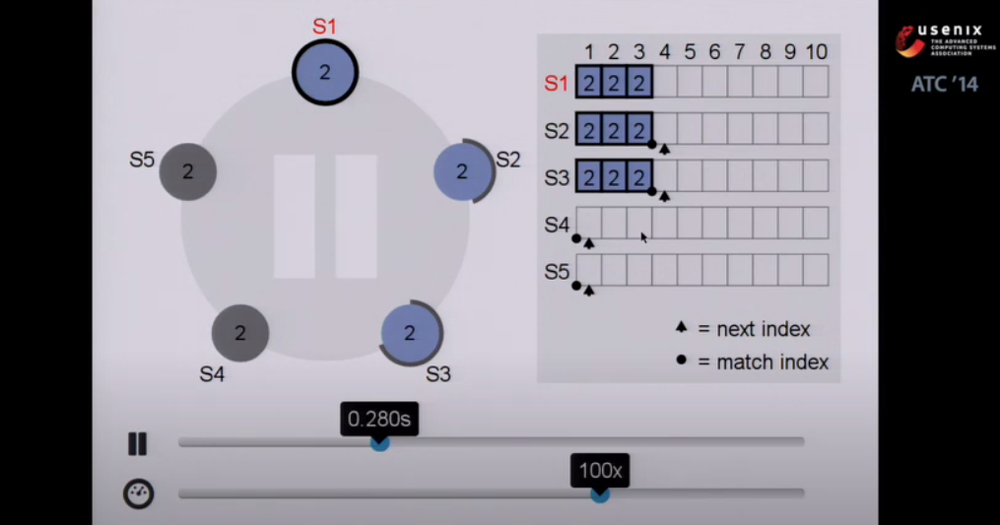
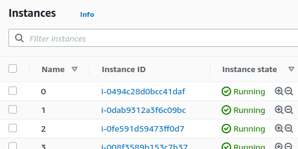
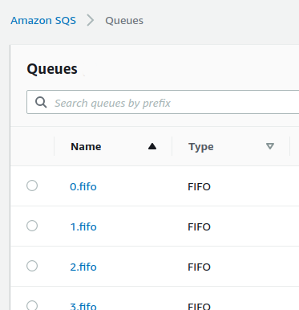
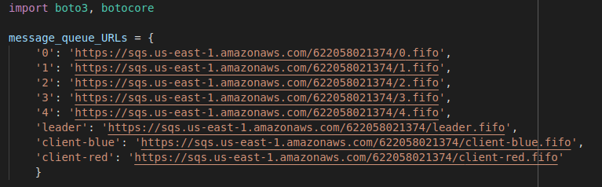

# Rock 'Em Sock 'Em: Supported by RAFT

 
You may be familiar with the game where the [red robot hits the blue robot](https://www.mattelgames.com/en-us/kids/rock-em-sock-em). This project uses a simple online, text-based implemenation of the game to demonstrate the algorithm that keeps track of game state. 

Suppose you have a two player game where each player connects to a central game server. If that server were to crash, the game would fail as well. RAFT is an algorithm that allows for a set of replicated servers to provide game state seamlessly and consistently despite failures. From the perspective of the players, the experience is no different from talking to a single server, yet the server cluster can seamlessly recover from server failure with no loss of information or inconsistent data. 

## RAFT
---
RAFT is most accurately described as a consensus algorithm. This relates to many systems because any set of nodes that intend to serve as a fault-tolerant cluster of replicated data must agree on that data---even if nodes fail or messages between nodes are lost. 

For the in-depth explanation of RAFT, check out the original paper [here](https://raft.github.io/raft.pdf). This project represents a working implementation of the algorithm described in detail in that paper. 

For a crash course in the RAFT algorithm, check out the conference presentation below: 

[](https://youtu.be/no5Im1daS-o)

This implementation of raft uses cluster nodes as illustrated in the above video. However, any number (preferrably >= 3) can be used. An odd number of nodes helps prevent excessive leadership elections. 


## Setup and Dependencies
---
This code depends on the Amazon [AWS SDK for Python (Boto 3)](https://aws.amazon.com/sdk-for-python/)
```bash
pip install boto3
```
This project was designed to run on AWS EC2 instances. However, as long as the Amazon SQS queues are set up, these five nodes could just as well be run all on a local machine, even in the same directory (the names of the files written do disk differ by the node number). AWS credentials will still have to be set up for the local machine. 



```bash
aws configure
```

For anyone still getting used to setting up AWS services, we found the easiest way to get the instance up and running was to install git, clone this repo, install python3, pip install boto3, and finally use the `aws configure` command to set up the instance [aws credentials](https://docs.aws.amazon.com/sdk-for-java/v1/developer-guide/setup-credentials.html). In our case the credentials lived in `~/.aws/credentials`. 

The network runs using Amazon SQS FIFO queues and Content-based deduplication turned on. 



The urls for those queues are hardcoded in `Messenger.py`. Note that these files assume a certain URL format and that the names of these nodes match the expected scheme of '0', '1', '2', '3', '4', 'leader', 'client-blue', and 'client-red'. 



**Running the Network**
---
```bash
python3 Node.py 0
```
Each instance is started by running the `Node.py` file with the node ID as a command line argument. If the AWS credentials are set up correctly and the queue URLs are correct, the network will wait for incoming transactions. 


[Here](https://www.youtube.com/watch?v=VBcIQC6Ze3M) is a video walking through the project. 
