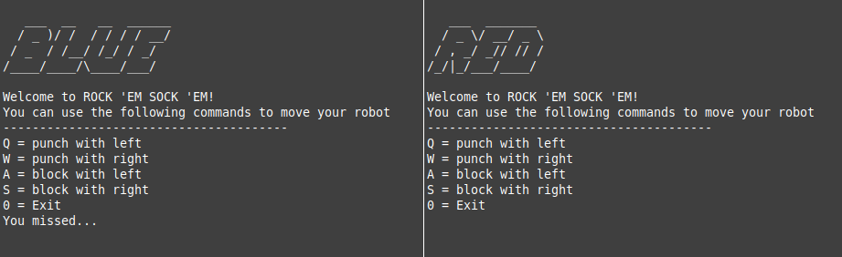

# Rock 'Em Sock 'Em: Supported by RAFT

 
You may be familiar with the game where the [red robot hits the blue robot](https://www.mattelgames.com/en-us/kids/rock-em-sock-em). This project uses a simple online, text-based implemenation of the game to demonstrate the algorithm that keeps track of game state. 

Suppose you have a two player game where each player connects to a central game server. If that server were to crash, the game would fail as well. RAFT is an algorithm that allows for a set of replicated servers to provide game state seamlessly and consistently despite failures. From the perspective of the players, the experience is no different from talking to a single server, yet the server cluster can seamlessly recover from server failure with no loss of information or inconsistent data. 

**RAFT**
---
RAFT is most accurately described as a consensus algorithm. This relates to many systems because any set of nodes that intend to serve as a fault-tolerant cluster of replicated data must agree on that data---even if nodes fail or messages between nodes are lost. 

[Here](https://www.youtube.com/watch?v=VBcIQC6Ze3M) is a video walking through the project. 
